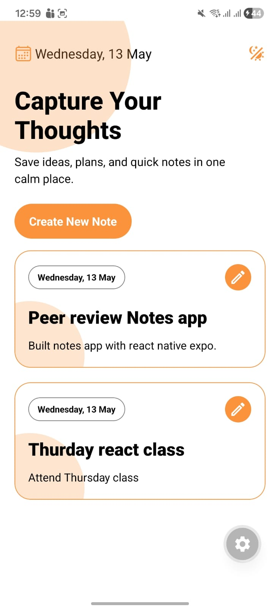
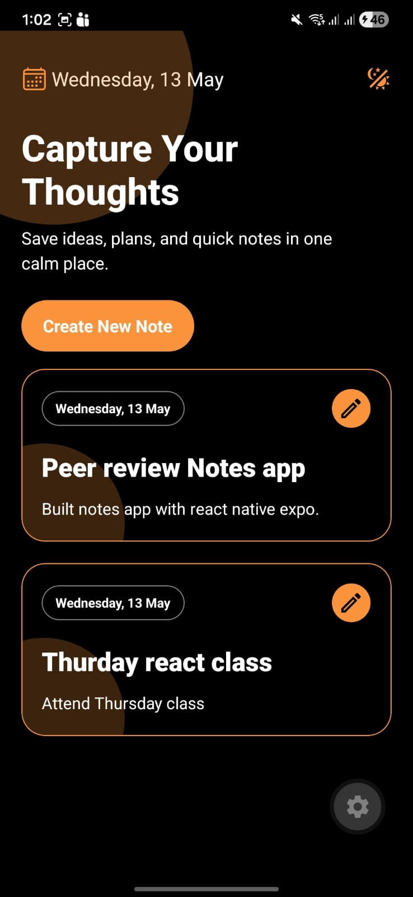
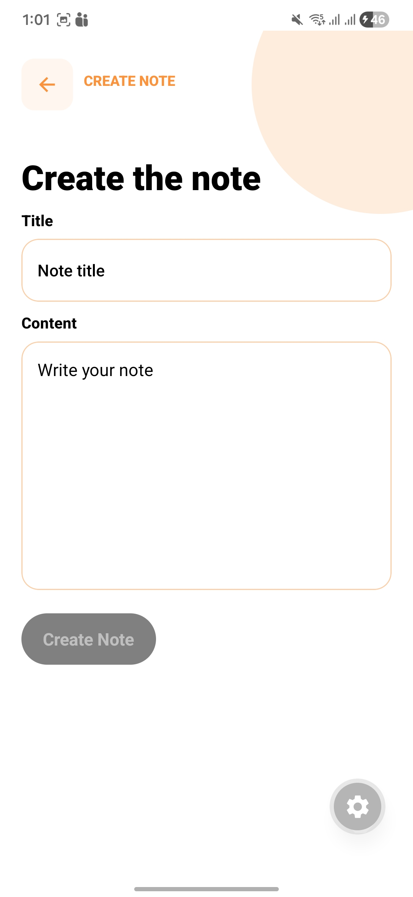
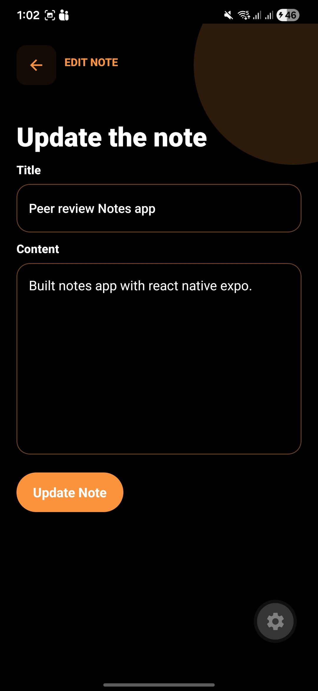

# Notes App

A clean mobile notes app built with Expo and React Native. The app supports listing notes, creating notes, editing existing notes, and switching between light and dark themes.

## Tech Stack

- Expo
- React Native
- TypeScript
- Expo Router
- React Context API

## React Native Components Used

- `View`
- `Text`
- `TextInput`
- `Pressable`
- `FlatList`
- `KeyboardAvoidingView`
- `StyleSheet`
- `SafeAreaView`

## Hooks Used

- `useState`
- `useContext`
- `useColorScheme`
- `useTheme`
- `useNotes`
- `useRouter`
- `useLocalSearchParams`

## Features

- Notes listing screen
- Create note form
- Edit note form by note id
- Theme toggle support
- Reusable note card, button, header, and form components

## How to Use the App

1. Open the app to view all saved notes on the home screen.
2. Tap `Create New Note` to open the note creation form.
3. Enter a title and note content, then save the note.
4. Tap any note card from the list to open the edit screen for that note.
5. Update the title or content, then save the changes.
6. Use the theme icon in the header to switch between light and dark mode.

## Screenshots

| Header 1                                                   | Header 2                                             |
| ---------------------------------------------------------- | ---------------------------------------------------- |
|           |       |
|  |  |
